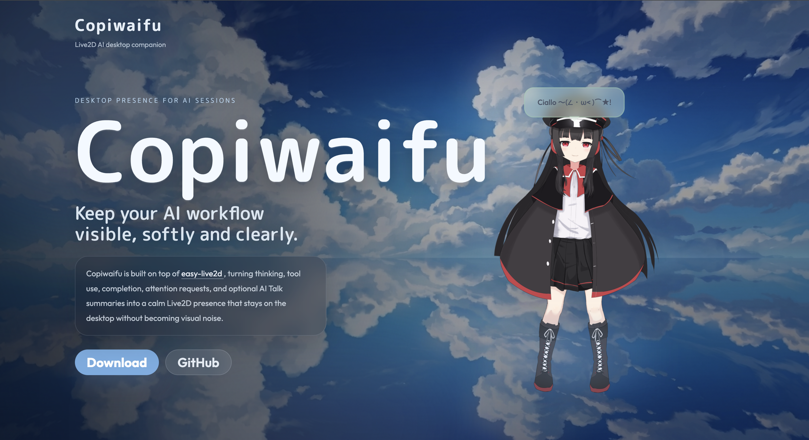
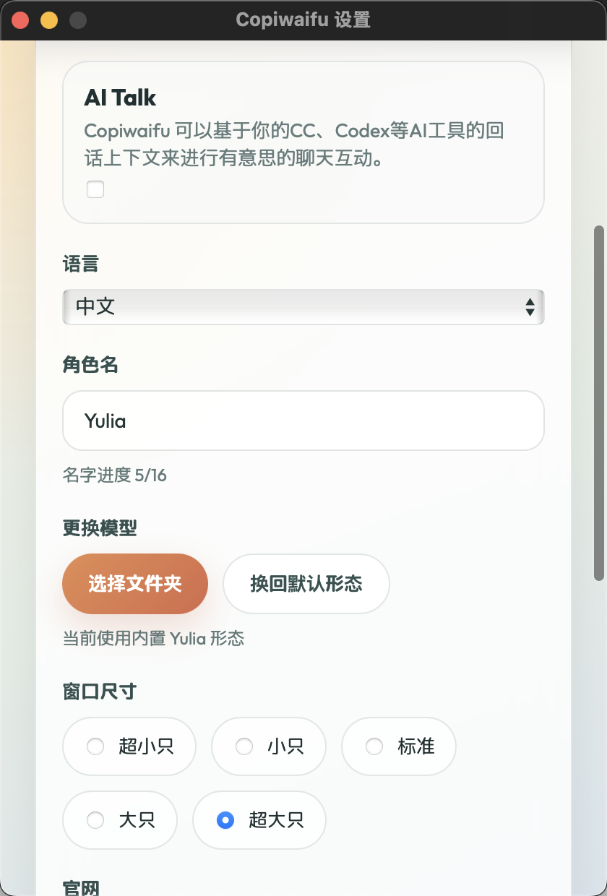

演示视频：https://www.bilibili.com/video/BV1s4RBBDEmq

---



## 这东西是干嘛的

Copiwaifu 是一个能和各个AI工具联动的 Live2D 桌宠。她会偷听你和 Claude Code、GitHub Copilot、Codex、Gemini CLI、OpenCode 的对话，然后在桌面上和你互动。

AI 思考的时候她跟着皱眉，调用工具了她换个姿势，任务跑完或者炸了，她还能根据上下文说两句。总之就是个可爱的 AI 助手，在你Vibe Coding的过程中作为副机长一起为你护航（Copi～）。

你可以把她当电子小黄鸭来 Debug，或者赛博老婆（划掉）。也能换成你自己喜欢的 Live2D 模型。

> 

## 技术细节

### 架构

- 前端：Vue 3 + TypeScript + Vite 6
- 桌面框架：Tauri 2 + Rust（macOS 用了 private API 做窗口穿透）
- Live2D 渲染：PixiJS 8 + [easy-live2d](https://github.com/Panzer-Jack/easy-live2d)
- AI 运行时：Node.js sidecar + Vercel AI SDK + esbuild 打包

### Hook 怎么接的

应用启动后在本机 `127.0.0.1` 起一个 HTTP 服务，默认端口 23333。然后往各个 AI CLI 的配置文件里注入 hook 脚本，这些脚本会在 AI 工具的关键节点（思考、调工具、完成、报错）向本地服务上报事件。

当前接入的 CLI：

| AI 工具        | 配置路径                               |
| -------------- | -------------------------------------- |
| Claude Code    | `~/.claude/settings.json`              |
| GitHub Copilot | `~/.config/github-copilot/config.json` |
| Codex          | `~/.codex/config.toml`                 |
| Gemini CLI     | `~/.gemini/settings.json`              |
| OpenCode       | `~/.config/opencode/opencode.json`     |

注入前会把你原有的 hook 配置备份到 `~/.copiwaifu/hooks/original-hooks.json`，不会弄丢你已有的 hook 链。

### 状态机

Hook 上报的原始事件经过 Rust 端的 reducer，转换成六种状态：

- `idle` — 空闲
- `thinking` — 在想
- `tool_use` — 在调工具
- `complete` — 跑完了
- `error` — 炸了
- `needs_attention` — 需要你看一眼

每种状态可以绑不同的 Live2D 动作组。没手动绑的，应用会试着自动匹配常见动作组名（Idle、Thinking、ToolUse、Complete）。

### AI Talk 的边界

AI Talk 默认关闭。开启后，只在 session 进入 `complete` 或 `error` 时触发，每轮只触发一次。它拿到的信息是 Copiwaifu 已经存好的 session 元信息：Agent 类型、工作目录、session 标题、最近事件和摘要。不读完整对话记录，不碰项目文件，不碰源码。

模型调用失败就静默回退到静态气泡，桌宠上不会弹报错信息。生成的内容也不会写回原 AI CLI。

模型服务商支持：OpenAI、Anthropic、Google Gemini、DeepSeek、阿里云百炼/Qwen、Moonshot Kimi、智谱 GLM、火山方舟/豆包、百度千帆/ERNIE、腾讯混元、MiniMax，以及任意 OpenAI 兼容 API。

### 换模型

内置了一个叫 Yulia 的 Live2D 模型。你也可以在设置里导入自己的模型目录，应用会校验里面有没有合法的 `.model3.json` 入口文件。

> 

## 怎么用

目前只有 macOS 版（Apple Silicon 和 Intel 都有），欢迎 PR 适配其他平台。

从 [GitHub Releases](https://github.com/Panzer-Jack/Copiwaifu/releases) 下载，拖进 Applications，终端跑一下：

```bash
xattr -dr com.apple.quarantine /Applications/copiwaifu.app
```

macOS 对未签名应用的限制，跑完就能正常打开。

打开之后她会自动装 hook、起本地服务。你正常用 Claude Code 或者其他 AI 工具写代码就行，桌宠自己会动。想要 AI Talk 就去设置里开，选个模型服务商，填 API Key 和模型 ID。

## 想参与开发

```bash
# 需要 Node.js、pnpm、Rust toolchain
pnpm install
pnpm run  # 等同于 pnpm tauri dev
```

项目结构：

- `src/` — Vue 3 前端，主窗口、设置窗口、Live2D 渲染
- `src-tauri/src/` — Rust 后端，hook 安装、HTTP 服务、事件处理、session 管理
- `sidecar/ai-runtime/` — Node.js AI 运行时，Vercel AI SDK 调各家模型
- `hooks/` — 各 AI CLI 的 hook 脚本
- `public/Resources/Yulia/` — 内置 Yulia 模型

---

有问题或者想法欢迎来直接开 Issue🥺。

Github：https://github.com/Panzer-Jack/Copiwaifu

官网：https://copiwaifu.panzer-jack.cn/
