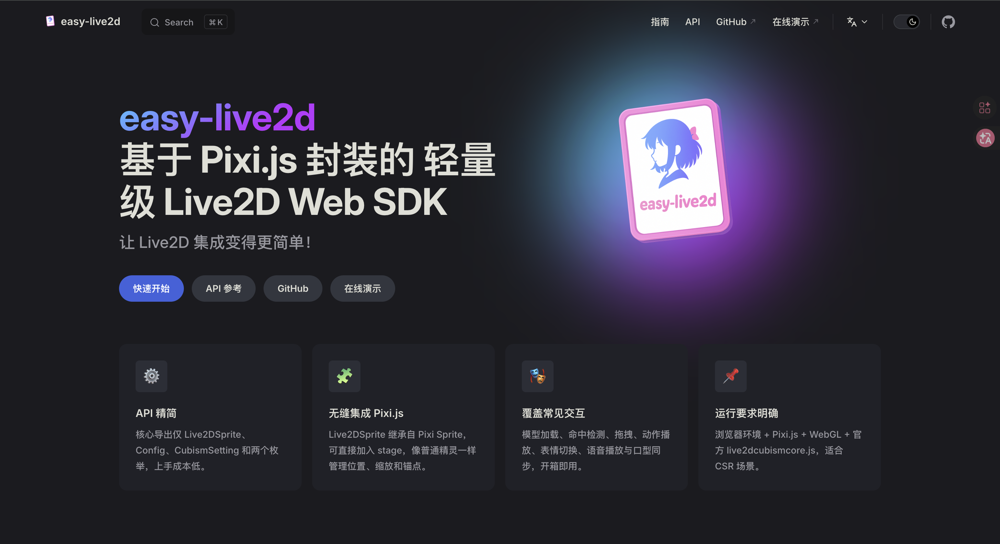

> 5 行代码加载模型，1 行代码播放语音口型同步，支持你Cubism3 ～ 5 的模型。这就是 v0.4.0。

📖 [官方文档](https://panzer-jack.github.io/easy-live2d) ｜ ⚡ [在线体验](https://stackblitz.com/~/github.com/Panzer-Jack/easy-live2d-playground) ｜ 🐙 [GitHub](https://github.com/Panzer-Jack/easy-live2d)

---

## 这个版本做了什么？

v0.4.0 对应的是项目里程碑 **Milestone 2: Advanced Core Capability Enhancement**，目标是增强核心能力、支持更多模型格式、重构整体架构。简单来说——在保持对外API相同的基础上，内部几乎重写了一遍。

v0.4.0 是 easy-live2d 从"能用"到"好用"的关键一步。

| 特性     | 变化                                  |
| -------- | ------------------------------------- |
| 项目架构 | 单体 → monorepo，模块化拆分           |
| 代码设计 | 门面模式 + 控制器分离 + 事件总线      |
| 渲染引擎 | 解决 WebGL 状态冲突，深度集成 Pixi.js |
| 框架兼容 | 新增 Tauri 支持，验证多环境兼容       |
| 语音系统 | 通用音频解码 + 实时 RMS 口型同步      |
| 音频格式 | 支持所有浏览器可解码格式 + 网络音频   |
| 模型兼容 | Cubism 3/4/5 全版本支持               |
| 文档     | VitePress 文档站，中英双语            |

## 你的模型，现在都能用了

之前用 easy-live2d，你可能遇到过"这个模型加载不了"的问题。v0.4.0 把这个痛点解决了——**Cubism 3、4、5 版本的模型全部支持**。

不管你的模型是几年前的老资源，还是用最新 Cubism Editor 5 制作的，直接传入 `model3.json` 路径就能用：

```ts
const sprite = new Live2DSprite({
  modelPath: '/Resources/YourModel/model.model3.json',
  ticker: Ticker.shared,
})
app.stage.addChild(sprite)
```

就这么简单。不需要关心模型是哪个版本的 Cubism，easy-live2d 会帮你处理。

---

## 让角色开口说话

v0.4.0 最让人兴奋的更新之一：**语音口型同步**。给模型播放一段语音，嘴型会自动跟着动。

```ts
await sprite.playVoice({
  voicePath: '/sounds/hello.mp3',
})
```

一行代码，角色就"说话"了。你可以用它做虚拟主播、AI 对话角色、互动教学……任何需要角色"开口"的场景。

而且不挑格式——mp3、wav、ogg 都行，甚至可以直接传一个远程音频 URL：

```ts
await sprite.playVoice({
  voicePath: 'https://your-api.com/tts/generate?text=你好',
})
```

这意味着你可以直接对接 TTS 服务，让 Live2D 角色实时"说"出 AI 生成的语音。

<!-- 📸 截图位置 B：语音口型同步效果（建议用 GIF 动图展示嘴型变化） -->

> [easy-live2d 语音口型同步效果演示](https://www.bilibili.com/video/BV15ZDKBvEuq/?share_source=copy_web&vd_source=7ef4bb0a336ea0e8c4b428335a4ed428)

---

## 和 Pixi.js 场景完美共存

如果你之前尝试过在 Pixi.js 项目里嵌入 Live2D，大概率遇到过渲染闪烁、画面错乱的问题。v0.4.0 彻底修复了这些渲染冲突。

现在 Live2D 模型就是一个普通的 Pixi.js Sprite，你可以像操作任何 Sprite 一样操作它：

```ts
// 调整大小和位置
sprite.width = 400
sprite.x = 100
sprite.y = 200

// 和其他 Pixi 元素一起使用
const container = new Container()
container.addChild(background)
container.addChild(sprite)  // Live2D 角色
container.addChild(uiLayer)
```

Live2D 角色可以和你的 UI、背景、特效层叠在一起，互不干扰。

<!-- 📸 截图位置 C：Live2D 模型与其他 Pixi.js 元素共存的场景效果 -->


## 丰富的互动能力

v0.4.0 提供了一套开箱即用的互动功能，让你的角色不只是"站在那里"：

**鼠标跟随** — 角色的眼睛和身体会跟着鼠标转动：

```ts
Config.MouseFollow = true
```

**点击互动** — 点击角色的不同区域触发不同反应：

```ts
sprite.onLive2D('hit', ({ hitAreaName }) => {
  if (hitAreaName === 'Head') {
    sprite.setExpression({ expressionId: 'smile' })
  }
})
```

**拖拽** — 让角色可以被拖动：

```ts
const sprite = new Live2DSprite({
  modelPath: '/Resources/Hiyori/Hiyori.model3.json',
  draggable: true,
})
```

**动作和表情** — 随时切换角色的动作和表情：

```ts
// 播放动作
await sprite.startMotion({
  group: 'TapBody',
  no: 0,
  priority: Priority.Normal,
})

// 切换表情
sprite.setExpression({ expressionId: 'smile' })
```


## 在哪都能跑

不管你用什么技术栈，easy-live2d 都能融入你的项目：

- **纯 HTML** — 一个 `<script type="module">` 就够了
- **Vue / React + Vite** — 作为 npm 包直接引入
- **Tauri 桌面应用** — v0.4.0 新增支持，做桌面宠物、桌面助手不在话下
- **StackBlitz** — 浏览器里直接开发调试，不用搭本地环境

安装只需要一行：

```bash
pnpm add easy-live2d pixi.js
```

在 HTML 入口加上 Cubism Core 引用：

```html
<script src="/Core/live2dcubismcore.js"></script>
```

然后就可以开始了。

下面是 easy-live2d + Tauri 桌宠的项目实例，感兴趣的可以看 [Copiwaifu：你的 Live2D AI 领航员，为每一次编码任务保驾护航。已与 ClaudeCode、Copilot 和 Codex 完成同步。](https://github.com/Panzer-Jack/Copiwaifu)


## 模型资源放在 CDN？没问题

如果你的模型资源托管在 CDN 或其他服务器上，可以用路径重定向一键搞定：

```ts
import { CubismSetting } from 'easy-live2d'

const setting = new CubismSetting(modelJson)
setting.redirectPath((path) => `https://cdn.example.com/models/${path}`)
```

所有模型相关的资源路径（贴图、物理、动作、表情）都会自动重定向，不需要手动改模型配置文件。

---

## 完整的文档支持

v0.4.0 配套了全新的文档站，中英双语，从快速上手到 API 细节都有覆盖。

👉 [查看文档](https://panzer-jack.github.io/easy-live2d)

<!-- 📸 截图位置 F：文档站首页 -->

## 

## 5 分钟快速上手

一个完整的最小示例：

```html
<!doctype html>
<html>
<head>
  <style>
    html, body { margin: 0; width: 100%; height: 100%; }
    #live2d { display: block; width: 100vw; height: 100vh; }
  </style>
</head>
<body>
  <canvas id="live2d"></canvas>
  <script src="/Core/live2dcubismcore.js"></script>
  <script type="module">
    import { Application, Ticker } from 'pixi.js'
    import { Config, Live2DSprite, Priority } from 'easy-live2d'

    Config.MouseFollow = true

    const app = new Application()
    await app.init({
      canvas: document.getElementById('live2d'),
      backgroundAlpha: 0,
    })

    const sprite = new Live2DSprite({
      modelPath: '/Resources/Hiyori/Hiyori.model3.json',
      ticker: Ticker.shared,
      draggable: true,
    })

    sprite.width = window.innerWidth
    app.stage.addChild(sprite)

    // 点击头部播放动作
    sprite.onLive2D('hit', async ({ hitAreaName }) => {
      if (hitAreaName === 'Head') {
        await sprite.startMotion({
          group: 'TapBody',
          no: 0,
          priority: Priority.Normal,
        })
      }
    })
  </script>
</body>
</html>
```

从零到一个可交互的 Live2D 角色，就这么多代码。

## 试试看

如果你正在做虚拟角色、AI 助手、桌面宠物、互动网页……任何需要 Live2D 的场景，v0.4.0 都值得一试。

- 🌐 [在线体验](https://stackblitz.com/~/github.com/Panzer-Jack/easy-live2d-playground) — 浏览器里直接跑
- 📖 [官方文档](https://panzer-jack.github.io/easy-live2d) — 从入门到进阶
- 🐙 [GitHub](https://github.com/Panzer-Jack/easy-live2d) — Star、Issue、PR 都欢迎
