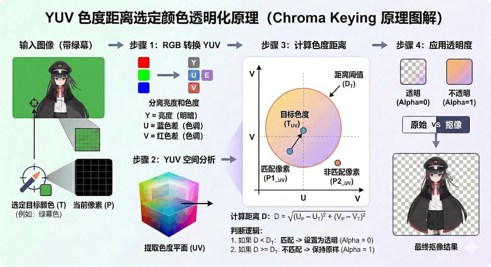
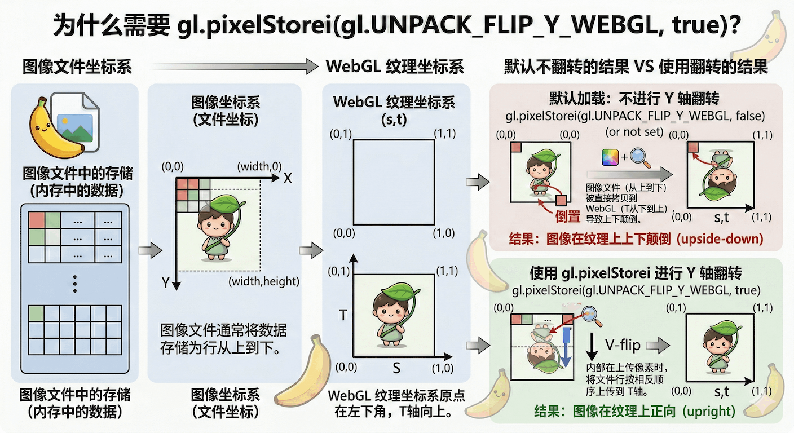

## 先简要介绍一下 WebGL

> 博主也是 WebGL 的新手，以下内容主要是基于我最近学习 WebGL 的一些笔记和总结，可能会有些零散和不系统，但希望能对同样想入门 WebGL 的朋友有所帮助。

当今大多数主流浏览器存在2个 WebGL 版本: `WebGL 1.0`（基于 OpenGL ES2.0）、`WebGL 2.0`（基于 OpenGL ES3.0）

```ts
const canvas = document.createElement('canvas');
const gl = canvas.getContext('webgl')
const gl2 = canvas.getContext('webgl2')
```

在 WebGL 中，所有的绘制操作都是通过着色器（Shader）来完成的。着色器是一段运行在 GPU 上的小程序，并且为一对函数的形式组成：

- `顶点着色器（Vertex Shader）`：负责处理每个顶点的数据，进行变换和投影等操作。

- `片段着色器（Fragment Shader）`：负责处理每个片段（像素）的数据，进行颜色计算和纹理采样等操作。

其组合又称为`程序（Program）`，而程序中的着色器会在 GPU 上对每个顶点/片元并行执行，这也是 WebGL 能够实现高性能图形渲染的原因之一。你可以想象如果是 CPU 处理，它只有少量核心，并且在Web场景上以单核心面对数百万个像素逐个计算，而 GPU 拥有成百上千个核心，可以同时处理大量像素，效率自然天差地别。

> 注意一点哦～ 是同时，即你写的着色器代码是同时针对单个顶点/片段的，GPU 会同时执行成千上万个这样的着色器实例来处理所有的顶点和片段，这就是并行计算的魅力所在。

在 WebGL 中，顶点着色器和片段着色器都是用 GLSL（OpenGL Shading Language）编写的。GLSL 是一种专门为图形编程设计的语言，具有类似于 C 语言的语法结构。我这边以WebGL 2.0为例，来展示一下最基本的着色器代码示例：

顶点着色器（Vertex Shader）示例：

```glsl
#version 300 es
// 👆这里的 #version 300 es 是告诉编译器我们使用的是 WebGL 2.0 的 GLSL 版本
// 并且必须放在着色器代码的第一行，否则将默认设置为 GLSL ES 1.00（即 WebGL 1.0 的语法）

// 声明输入变量 a_position，类型为 vec4（4维向量），表示顶点的位置
in vec4 a_position;

void main() {
  // 将输入的顶点位置直接赋值给内置变量 gl_Position，表示最终的顶点位置
  gl_Position = a_position;
}
```

片段着色器（Fragment Shader）示例：

```glsl
#version 300 es

// 声明浮点数的精度为 highp（高精度），这是 WebGL 2.0 中的一个要求，确保在片段着色器中使用高精度的浮点数
precision highp float;

// 声明输出变量 outColor，类型为 vec4（4维向量），表示片段的颜色
// 如果你使用的是 WebGL 1.0，那么片段着色器中应该使用内置变量 gl_FragColor 来输出颜色，而不是自定义的输出变量
// 在 WebGL 2.0 中，我们可以使用 out 关键字来声明一个输出变量，这样就不需要使用 gl_FragColor 了
// 并且在 WebGL 2.0 中，第一个声明的输出变量默认绑定到颜色缓冲区 0（即 gl_FragColor），所以我们可以直接使用 outColor 来输出颜色
out vec4 outColor;

// 如果有多个输出变量，我们可以使用 layout(location = X) 来指定它们在颜色缓冲区中的位置，这样就可以同时输出到多个缓冲区了
// 在 GLSL 中手动指定位置
// layout(location = 0) out vec4 outColor;     输出到颜色缓冲
// layout(location = 1) out vec4 outNormal;    输出到另一个缓冲

void main() {
  // 将输出颜色设置为红色（RGBA: 1.0, 0.0, 0.0, 1.0）
  outColor = vec4(1.0, 0.0, 0.0, 1.0);
}
```

#### 简要介绍一下核心概念：

1. `属性（Attribute）`、`缓冲区（Buffer）`、`顶点数组对象（Vertex Array Object，VAO）`：

`属性（Attribute）`：这是顶点着色器中的输入变量，用于接收每个顶点的数据，例如位置、颜色、纹理坐标等。属性变量在 JavaScript 中通过缓冲区对象（Buffer Object）传递给 GPU。

```glsl
// 这是一个属性变量，表示顶点的位置
// 命名以 a_ 开头是一个常见的约定，表示这是一个属性变量
in vec4 a_position;
```

`缓冲区（Buffer）`：这是 WebGL 中用于存储数据的对象，可以存储顶点数据、索引数据等。缓冲区在 JavaScript 中通过 WebGL API 创建和使用。

`顶点数组对象（Vertex Array Object，VAO）`：这是 WebGL 2.0 中引入的一个对象，用于管理属性变量和缓冲区之间的关系。简单来说，顶点数组对象相当于是一个状态快照，将属性变量的配置和绑定信息保存起来，这样在绘制时只需要绑定顶点数组对象即可恢复之前的配置，避免了重复设置属性变量和缓冲区的麻烦。同时需要注意当你使用完毕后要解绑顶点数组对象（VAO），以免记录到不需要的后续渲染操作。

2. `统一变量（Uniform）`：这是顶点着色器和片段着色器中的输入变量，用于接收全局数据，例如变换矩阵、光照参数等。统一变量在 JavaScript 中通过程序对象（Program Object）传递给 GPU。

```glsl
// 这是一个统一变量，表示纹理采样器，用于在片段着色器中访问纹理数据
// 命名以 u_ 开头是一个常见的约定，表示这是一个统一变量
uniform sampler2D u_texture;
```

3. `纹理（Texture）`：这是片段着色器中的输入变量，用于接收纹理数据，例如图片、视频等。纹理在 JavaScript 中通过纹理对象（Texture Object）传递给 GPU。（比如图片就是一种纹理）

```glsl
// 通常 纹理的采样器会被声明为一个统一变量，类型为 sampler2D，表示这是一个二维纹理
uniform sampler2D u_texture;
```

4. `内置变量（Built-in Variable）`：这是 GLSL 中预定义的变量，用于表示一些特殊的数据，例如 gl_Position（顶点位置）、gl_FragColor（片段颜色）等。这些变量在着色器中具有特殊的意义和用途。

```glsl
// 这是一个内置变量，表示最终的顶点位置，必须在顶点着色器中赋值
gl_Position = a_position;
```

5. `程序对象（Program Object）`：这是 WebGL 中用于管理着色器程序的对象，包含了顶点着色器和片段着色器的组合。程序对象在 JavaScript 中通过 WebGL API 创建和使用。

6. `插值变量（Varying）`：这是顶点着色器和片段着色器之间的变量，用于在两者之间传递数据，例如颜色、纹理坐标等。插值变量在 JavaScript 中通过程序对象传递给 GPU。(比如常见的渐变色就是通过插值变量来实现的)

> 注意：在 WebGL 2.0 中，插值变量的显示声明已经被废弃，取而代之的是使用 out 关键字在顶点着色器中声明输出变量，并在片段着色器中使用 in 关键字声明输入变量来接收这些数据。

## 实现一个图片背景透明化小工具

#### GLSL 核心转换逻辑代码：

> 核心算法是：将 RGB 颜色空间转换为 YUV 颜色空间，在排除掉亮度（Y）分量的影响后，计算色度（UV）分量之间的距离来判断颜色是否接近于选取的颜色，从而实现选取色彩透明化的效果。



- 顶点着色器（Vertex Shader）：

```glsl
#version 300 es

// 顶点位置属性变量，表示每个顶点的位置
in vec2 a_position;
// 纹理坐标属性变量，表示每个顶点对应的纹理坐标
in vec2 a_texCoord;

// varying 变量，用于在顶点着色器和片段着色器之间传递纹理坐标数据
// 使用线性插值变量，GPU 会自动在顶点之间进行插值计算，使得片段着色器能够获得每个片段对应的纹理坐标
out vec2 v_texCoord;

void main() {
  gl_Position = vec4(a_position, 0.0, 1.0);

  v_texCoord = a_texCoord;
}
```

- 片段着色器（Fragment Shader）：

```glsl
#version 300 es
precision highp float;

// 从顶点着色器传递过来的纹理坐标变量
in vec2 v_texCoord;

// 统一变量：图片纹理
uniform sampler2D u_image;
// 统一变量：选取的颜色
uniform vec3 u_pickColor;
// 统一变量：容差值，用于控制颜色匹配的范围
uniform float u_tolerance;

out vec4 outColor;

// RGB 转 YCbCr 的转换矩阵
const mat3 rgb2ycbcr = mat3(
  0.299,  -0.169,   0.500,
  0.587,  -0.331,  -0.419,
  0.114,   0.500,  -0.081
);

void main() {
  vec4 color = texture(u_image, v_texCoord);
  vec3 rgb = color.rgb;

  // 将当前像素的 RGB 颜色转换为 YCbCr 颜色空间
  vec3 pickYcbcr = rgb2ycbcr * u_pickColor;

  // 计算当前像素的 RGB 颜色与选取颜色在 YCbCr 颜色空间中的距离
  float dist = distance(rgb2ycbcr * rgb, pickYcbcr);

  // 使用 smoothstep 实现柔和的边缘过渡，根据距离和容差值计算出 alpha 值，使得颜色接近选取颜色的像素变得透明，而其他像素保持不变
  float edge = u_tolerance * 0.15;
  float alpha = smoothstep(u_tolerance - edge, u_tolerance + edge, dist);

  outColor = vec4(rgb, alpha);
}

```

#### 准备好 WebGL在JS的基础工具函数集

首先第一个是`编译着色器（Compile Shader）`，它将 GLSL 代码编译成 GPU 可执行的着色器对象。

```ts
export function compileShader({
  gl,
  type,
  source,
}: {
  gl: WebGL2RenderingContext
  type: number
  source: string
}) {
  const shader = gl.createShader(type)!
  gl.shaderSource(shader, source)
  gl.compileShader(shader)

  // 检查着色器编译是否成功，如果失败则获取错误信息并抛出异常
  if (!gl.getShaderParameter(shader, gl.COMPILE_STATUS)) {
    const info = gl.getShaderInfoLog(shader)
    gl.deleteShader(shader)
    throw new Error(`Shader compile error: ${info}`)
  }
  return shader
}
```

第二个是创建`程序对象（Program Object）`
它将`顶点着色器（Vertex Shader）`和`片段着色器（Fragment Shader）`编译并链接成一个可用的程序对象，供后续的渲染使用。

```ts
// 创建程序的工具函数，接受 WebGL 上下文、顶点着色器源代码和片段着色器源代码作为参数，返回链接后的程序对象
export function createProgram({
  gl,
  vertexShader,
  fragmentShader,
}: {
  gl: WebGL2RenderingContext
  vertexShader: string
  fragmentShader: string
}) {
  const vs = compileShader({ gl, type: gl.VERTEX_SHADER, source: vertexShader })
  const fs = compileShader({ gl, type: gl.FRAGMENT_SHADER, source: fragmentShader })

  const program = gl.createProgram()!
  gl.attachShader(program, vs)
  gl.attachShader(program, fs)
  gl.linkProgram(program)

  // 检查程序链接是否成功，如果失败则获取错误信息并抛出异常
  if (!gl.getProgramParameter(program, gl.LINK_STATUS)) {
    const info = gl.getProgramInfoLog(program)
    gl.deleteProgram(program)
    throw new Error(`Program link error: ${info}`)
  }
  return program
}
```

第三个是创建`纹理对象（Texture Object）`，它用于在 GPU 上存储图像数据，以便在着色器中进行采样和渲染。

`gl.pixelStorei(gl.UNPACK_FLIP_Y_WEBGL, true)` 这一行代码的作用是告诉 WebGL 在上传纹理数据时自动将图片进行垂直翻转，以适应 WebGL 的坐标系统。因为在 WebGL 中，纹理坐标的原点位于左下角，而在 HTML 中，图片的原点位于左上角，所以需要进行垂直翻转来确保纹理正确显示。
直接来看下面这张图👇

我们可以看到在 WebGL 中，纹理坐标的原点（0, 0）位于左下角，而在 HTML 中，图片的原点（0, 0）位于左上角。因此，在实际接收到由 HTML 图片元素上传的纹理数据时，WebGL 会默认将其视为从左下角开始的纹理坐标系统，这就导致了图片在 WebGL 中显示时会被颠倒过来。

```ts
export function createTexture({
  gl,
  image,
}: {
  gl: WebGL2RenderingContext
  image: HTMLImageElement
}) {
  const texture = gl.createTexture()!
  gl.bindTexture(gl.TEXTURE_2D, texture)
  // 设置 UNPACK_FLIP_Y_WEBGL 参数为 true，可以在上传纹理数据时自动将图片进行垂直翻转，以适应 WebGL 的坐标系统
  gl.pixelStorei(gl.UNPACK_FLIP_Y_WEBGL, true)
  // 将图片数据上传到 GPU 上的纹理对象中，指定纹理的格式和数据类型
  gl.texImage2D(gl.TEXTURE_2D, 0, gl.RGBA, gl.RGBA, gl.UNSIGNED_BYTE, image)

  // 下面这些操作主要是为了优化处理一些缩放和图片边缘问题。
  // 生成 mipmap、设置纹理的包装模式和过滤模式等，以确保纹理在不同缩放级别下能够正确显示
  gl.generateMipmap(gl.TEXTURE_2D)
  // 这2行代码设置了纹理的包装模式为 CLAMP_TO_EDGE，表示纹理坐标超出 [0, 1] 范围时会被夹紧到边缘像素的颜色，而不是重复或镜像纹理。
  // 这对于我们这种需要对图片进行透明化处理的场景来说是非常重要的，因为我们不希望在边缘出现不必要的重复或镜像效果。
  gl.texParameteri(gl.TEXTURE_2D, gl.TEXTURE_WRAP_S, gl.CLAMP_TO_EDGE)
  gl.texParameteri(gl.TEXTURE_2D, gl.TEXTURE_WRAP_T, gl.CLAMP_TO_EDGE)
  // 这2行代码设置了纹理的过滤模式，分别是缩小过滤（TEXTURE_MIN_FILTER）和放大过滤（TEXTURE_MAG_FILTER）。
  // 对于缩小过滤，我们使用了 LINEAR_MIPMAP_LINEAR，这是一种三线性过滤模式，可以在不同 mipmap 级别之间进行平滑过渡，从而获得更好的视觉效果。
  // 对于放大过滤，我们使用了 LINEAR，这是一种双线性过滤模式，可以在放大纹理时进行平滑插值，避免出现锯齿状的边缘。
  // 这些设置可以确保我们的纹理在不同缩放级别下都能够正确显示，并且在进行透明化处理时不会出现明显的锯齿或模糊现象。
  gl.texParameteri(gl.TEXTURE_2D, gl.TEXTURE_MIN_FILTER, gl.LINEAR_MIPMAP_LINEAR)
  gl.texParameteri(gl.TEXTURE_2D, gl.TEXTURE_MAG_FILTER, gl.LINEAR)

  return texture
}
```

第四个是创建`顶点数组对象（Vertex Array Object，VAO）`，它用于管理属性变量和缓冲区之间的关系，简化了渲染时的状态设置。

```ts
export function createFullRenderAreaVAO({
  gl,
  program,
}: {
  gl: WebGL2RenderingContext
  program: WebGLProgram
}) {
  const vao = gl.createVertexArray()!
  gl.bindVertexArray(vao)

  // 定义一个包含顶点位置和纹理坐标的缓冲区数据，表示一个覆盖整个渲染区域的矩形（由两个三角形组成）
  // 每个顶点包含4个浮点数，前两个表示位置（x, y），后两个表示纹理坐标（u, v）
  // （x, y） 的范围是 [-1, 1]，表示覆盖整个裁剪空间，而（u, v）的范围是 [0, 1]，表示覆盖整个纹理空间
  const bufferData = new Float32Array([
      -1, -1, 0, 0,
      1, -1, 1, 0,
      -1, 1, 0, 1,
      1, 1, 1, 1
  ])
  const buffer = gl.createBuffer()!
  gl.bindBuffer(gl.ARRAY_BUFFER, buffer)
  gl.bufferData(gl.ARRAY_BUFFER, bufferData, gl.STATIC_DRAW)

  // 步长（stride）表示每个顶点数据的字节长度，这里是4个浮点数，每个浮点数占用4字节，所以总共是16字节
  const stride = 4 * Float32Array.BYTES_PER_ELEMENT

  // 获取顶点着色器中属性变量 a_position 的位置，并启用该属性数组，然后设置属性指针，告诉 WebGL 如何从缓冲区中读取数据来填充 a_position 变量
  const posLoc = gl.getAttribLocation(program, 'a_position')
  gl.enableVertexAttribArray(posLoc)
  // 参数说明：位置属性的索引、每个顶点数据包含的组件数量（2表示x和y）、数据类型（FLOAT表示32位浮点数）、是否归一化（false表示不进行归一化）、步长（每个顶点数据的字节长度）、偏移量（0表示从缓冲区的起始位置开始读取）
  gl.vertexAttribPointer(posLoc, 2, gl.FLOAT, false, stride, 0)

  // 同理，并且这边的偏移量是2 * Float32Array.BYTES_PER_ELEMENT，表示纹理坐标数据在每个顶点数据中的位置（前两个浮点数是位置，后两个浮点数是纹理坐标，所以偏移量是2个浮点数的字节长度）
  const texLoc = gl.getAttribLocation(program, 'a_texCoord')
  gl.enableVertexAttribArray(texLoc)
  gl.vertexAttribPointer(texLoc, 2, gl.FLOAT, false, stride, 2 * Float32Array.BYTES_PER_ELEMENT)

  // 最后解绑顶点数组对象（VAO），以免记录到不需要的后续渲染操作
  gl.bindVertexArray(null)
  return vao
}

```

#### 利用工具函数集来实现Pick Alpha 的 逻辑层hook

这里使用了Vue3，你也可以根据自己的技术栈来调整实现方式，核心逻辑是一样的。
这个hook主要包含了以下功能：

- 初始化 WebGL 上下文和着色器程序
- 加载图片并创建纹理
- 处理画布点击事件，获取选取的颜色并更新渲染
- 根据选取的颜色和容差值重新渲染画布，实现透明化

```ts
import fs from '../shaders/fs.glsl?raw'
import vs from '../shaders/vs.glsl?raw'
import { createFullRenderAreaVAO, createProgram, createTexture } from '../utils/webgl'

export const usePickAlpha = ({ canvas }: { canvas: Ref<HTMLCanvasElement | null> }) => {
  const pickColor = ref<[number, number, number]>([0, 0, 0])
  const tolerance = ref(0)
  const hasImage = ref(false)

  let gl: WebGL2RenderingContext | undefined | null
  let program: WebGLProgram | undefined
  let vao: WebGLVertexArrayObject | undefined
  let imageData: ImageData | undefined
  let texture: WebGLTexture | undefined

  // 初始化 WebGL 上下文和着色器程序，创建顶点数组对象（VAO）来管理属性变量和缓冲区之间的关系
  const initWebGL = () => {
    gl = canvas.value?.getContext('webgl2', {
      premultipliedAlpha: false,
      preserveDrawingBuffer: true,
    })
    if (!gl) {
      console.error('WebGL2 is not supported in this browser.')
      return null
    }

    program = createProgram({ gl, vertexShader: vs, fragmentShader: fs })
    vao = createFullRenderAreaVAO({ gl, program })
  }

  // 渲染函数，根据当前的选取颜色和容差值重新渲染画布，实现透明化效果
  const render = () => {
    if (!gl || !program || !vao)
      return

    // 设置视口和清除画布
    gl.viewport(0, 0, gl.canvas.width, gl.canvas.height)
    gl.clearColor(0, 0, 0, 0)
    gl.clear(gl.COLOR_BUFFER_BIT)

    // 挂载程序（Program）和顶点数组对象（VAO）
    gl.useProgram(program)
    gl.bindVertexArray(vao)

    // 设置统一变量（Uniforms）
    const pickColorLoc = gl.getUniformLocation(program, 'u_pickColor')
    const toleranceLoc = gl.getUniformLocation(program, 'u_tolerance')
    gl.uniform3fv(pickColorLoc, pickColor.value)
    gl.uniform1f(toleranceLoc, tolerance.value)

    // 绘制
    gl.drawArrays(gl.TRIANGLE_STRIP, 0, 4)
    gl.bindVertexArray(null)
  }

  // 加载图片并创建纹理，同时获取图片的像素数据以便后续的颜色选取操作
  // 这里复制图片数据到一个临时的 canvas 上，以便我们能够通过 getImageData 获取到像素数据进行颜色选取的操作。
  const loadImage = (image: HTMLImageElement) => {
    if (!gl || !program || !vao || !canvas.value) {
      console.log('gl', gl, 'program', program, 'vao', vao, 'canvas', canvas.value)
      console.error('WebGL is not initialized.')
      return
    }

    canvas.value.width = image.naturalWidth
    canvas.value.height = image.naturalHeight

    const tmp = document.createElement('canvas')
    tmp.width = image.naturalWidth
    tmp.height = image.naturalHeight
    const ctx = tmp.getContext('2d')!
    ctx.drawImage(image, 0, 0)
    imageData = ctx.getImageData(0, 0, tmp.width, tmp.height)

    if (texture) {
      gl.deleteTexture(texture)
    }
    texture = createTexture({ gl, image })
    hasImage.value = true
    render()
  }

  // 处理画布点击事件，获取选取的颜色并更新渲染
  const handleCanvasClick = (event: MouseEvent) => {
    if (!canvas.value || !imageData)
      return

    const rect = canvas.value.getBoundingClientRect()
    const x = Math.floor((event.clientX - rect.left) / rect.width * canvas.value.width)
    const y = Math.floor((event.clientY - rect.top) / rect.height * canvas.value.height)

    const colorIdx = (y * imageData.width + x) * 4

    // 归一化 RGB 颜色值到 [0, 1] 范围，并更新 pickColor 的值
    pickColor.value = [
      imageData.data[colorIdx] / 255,
      imageData.data[colorIdx + 1] / 255,
      imageData.data[colorIdx + 2] / 255,
    ]

    console.log('Picked color:', pickColor.value)
    render()
  }

  onMounted(() => initWebGL())
  watch([pickColor, tolerance], () => render())

  return {
    pickColor,
    tolerance,
    hasImage,
    loadImage,
    handleCanvasClick,
    render,
  }
}

```

最后是View层的实现，这里就不赘述了，核心逻辑都在上面的hook里面了，你可以根据自己的技术栈来调整实现方式。

#### 实际效果（一个最小实现demo）

<PickAlpha />

## 最后供上 Pick Alpha 的完整版在线地址

- Pick Alpha: https://pick-alpha.panzer-jack.cn/

## 参考链接

1. https://webgl2fundamentals.org/webgl/lessons/zh_cn/webgl-fundamentals.html

2. https://messiahhh.github.io/blog/docs/canvas/webgl
