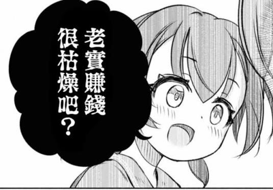

毕业快一年了，也逐渐从一个来考试的变成了一个考官，入口确实显而易见的越来越拥挤反观身边的同事数量却越来越显著的减少，AI技术的高速发展給生产力带入了大跃进时代，但是稍微停留一下就能发现貌似“市场”这块蛋糕的份额并没有因此增加多少只是过去能用堆人力解决的事情，现在反而全部都能用Agent去代替掉.

工作上最直观感觉就是产品出的需求越来越单薄数量也明显减少，存量市场在AI高生产力冲击下更加萎缩，越来越多公司开始持续性的降本增效大裁员，就现在claude这模型进化速度不知道传统互联网还能不能存在三年….

以上为一顿饭后的有感而发（
